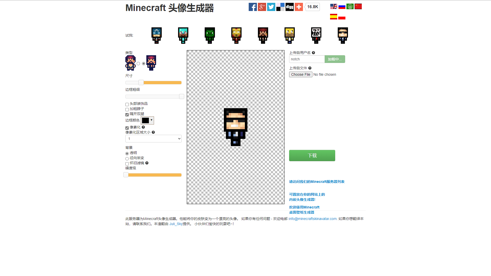
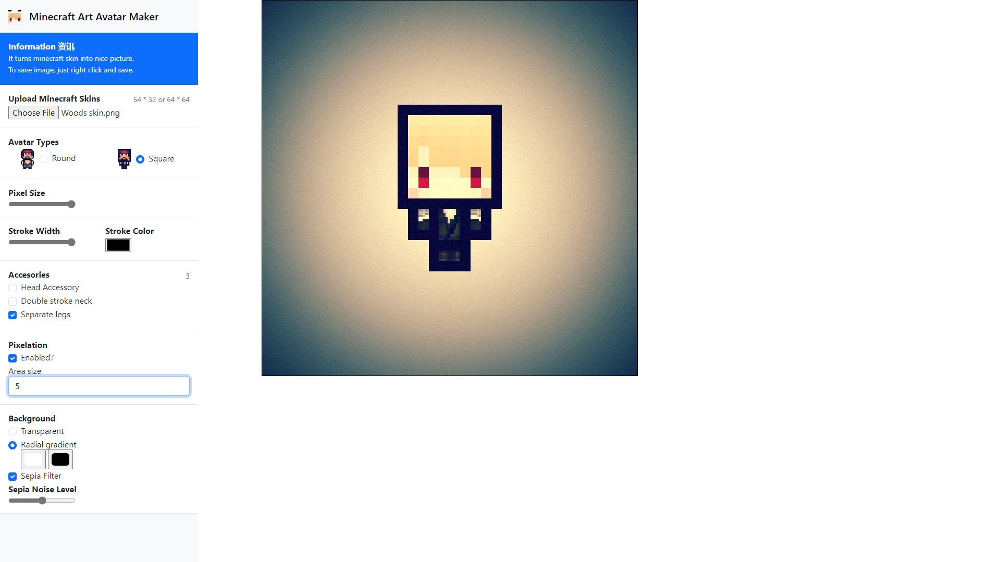

### Hosted by:

# Minecraft Art Avatar Maker 修復版
- 印象中，這網頁很久以前就存在了，只是不知道在哪一年的時候因爲伺服器沒了，所以就跟著沒了owo
- 所以呢，這個網頁就是用來延續以前該網頁的運作模式，只是把它改成純靜態的模式而已。
- 順帶更新一下裏面的libraries那些，例如支援bootstrap之類的
- 舊版本：
 
- 經過更新升級後的版本：
 
# 所使用的各种插件：
### 
-  —— 主要练习排版设计的好东西

### 
-  —— 核心JS，也是我目前最喜欢用的框架（或者说，最熟悉的）

# 主要内容：
- 這個網頁是全客戶端（也就是説，沒有任何數據會傳到伺服器）
- 你只需要上傳一個 64x32 或者 64x64 的玩家皮膚照片，就可以開始修改咯~
- 目前有想過要不要弄多國語言版，但想想還是算了（反正也沒多少人用）

# 目前进度：
- 静态：

# 一些隨記：
- 其實做這個網頁最難的地方反而是尋找一個能用的舊版本網頁（笑
- 其次就是更新非常老舊的javascript的寫法（還有大概率是因爲scrap來的關係，所有的代碼讀起來十分難懂）
